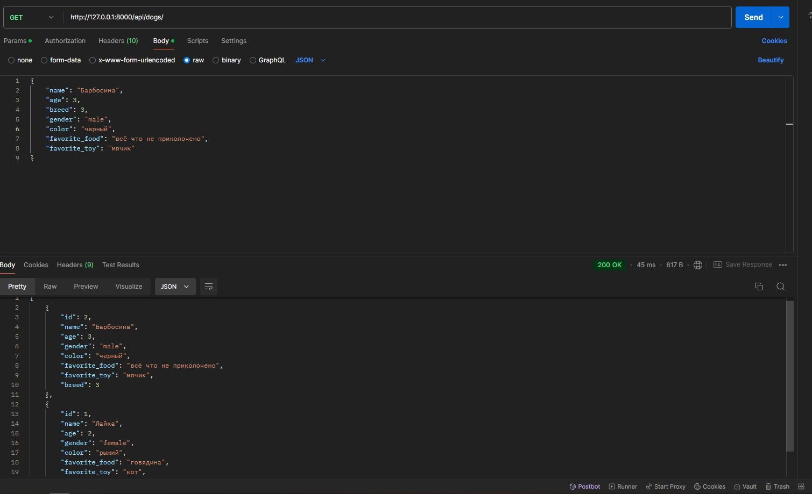
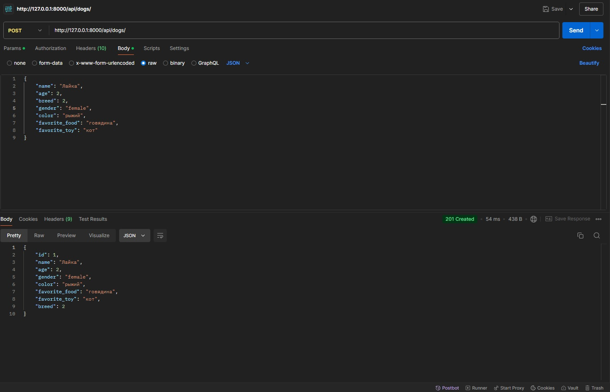
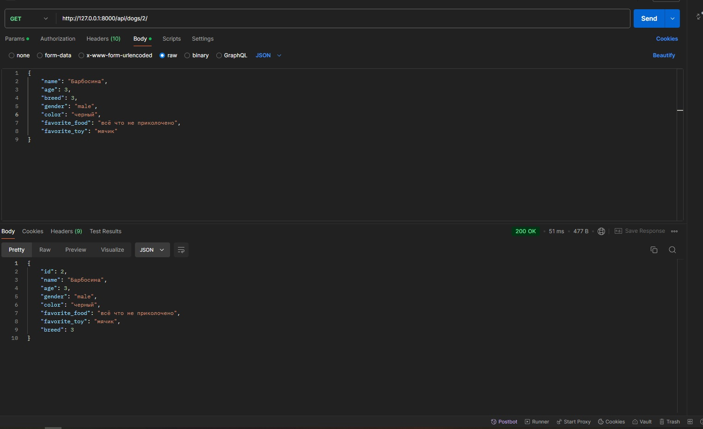
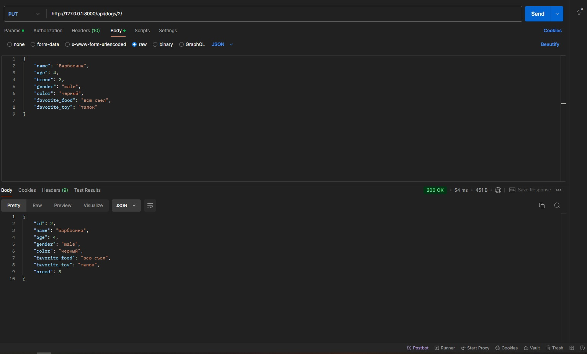
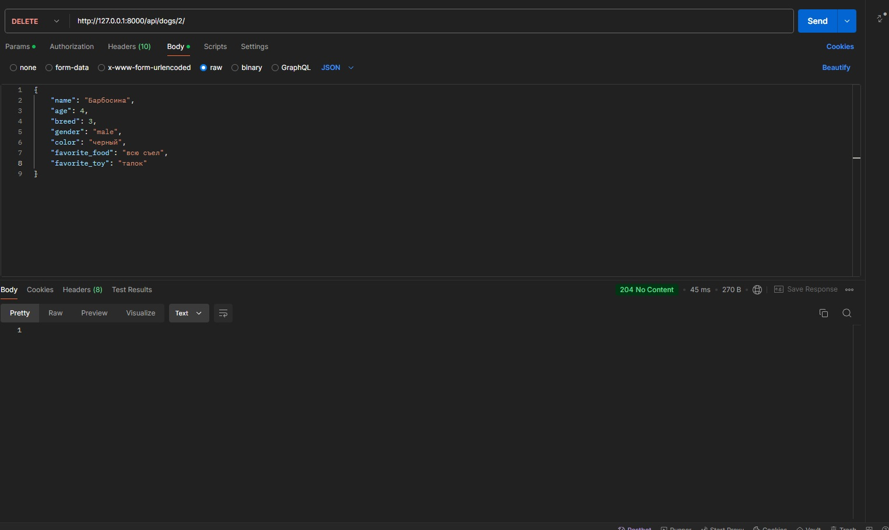
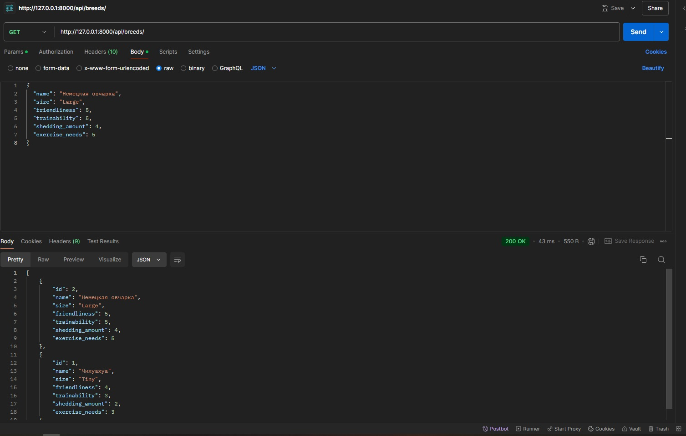
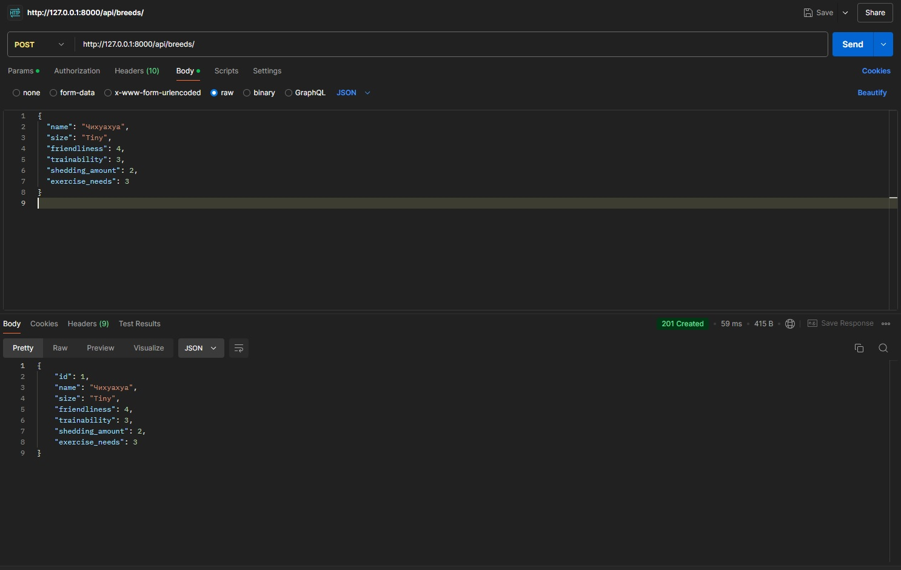

# Dog API

API для управления собаками и породами. Вы можете создавать, просматривать, редактировать и удалять записи о собаках и их породах.

## Модели

### Dog (Собака)
- **name**: Имя собаки (строка)
- **age**: Возраст собаки (целое число)
- **breed**: Порода (ссылка на модель Breed)
- **gender**: Пол собаки (строка)
- **color**: Окрас собаки (строка)
- **favorite_food**: Любимая еда (строка)
- **favorite_toy**: Любимая игрушка (строка)

### Breed (Порода)
- **name**: Название породы (строка)
- **size**: Размер (Tiny, Small, Medium, Large)
- **friendliness**: Дружелюбность (от 1 до 5)
- **trainability**: Обучаемость (от 1 до 5)
- **shedding_amount**: Количество шерсти при линьке (от 1 до 5)
- **exercise_needs**: Потребности в активности (от 1 до 5)

## API Эндпоинты

### Управление собаками
- **GET /api/dogs/** — Получить список всех собак  
  

- **POST /api/dogs/** — Добавить новую собаку  
  

- **GET /api/dogs/<id>/** — Получить информацию о собаке по ID  
  

- **PUT /api/dogs/<id>/** — Обновить информацию о собаке по ID  
  

- **DELETE /api/dogs/<id>/** — Удалить собаку по ID  
  

### Управление породами
- **GET /api/breeds/** — Получить список всех пород  
  

- **POST /api/breeds/** — Добавить новую породу  
  

- **GET /api/breeds/<id>/** — Получить информацию о породе по ID  
  

- **PUT /api/breeds/<id>/** — Обновить информацию о породе по ID  
  

- **DELETE /api/breeds/<id>/** — Удалить породу по ID  
  

---

Каждый скриншот отображает выполнение запросов к соответствующим эндпоинтам через Postman.
